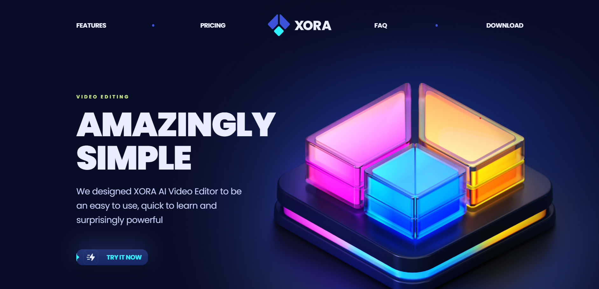

# Xora - AI Video Editing App Landing Page

This repository contains the source code for the landing page of **Xora**, an AI-powered video editing app for web and mobile platforms. The landing page is built with **React.js** and **Tailwind CSS**, utilizing a reusable component structure to ensure scalability and maintainability.

## Table of Contents
- [Features](#features)
- [Screenshots](#screenshots)
- [Technologies Used](#technologies-used)
- [Installation](#installation)
- [Usage](#usage)
- [Contributing](#contributing)
- [License](#license)

## Features
- **Responsive Design**: Optimized for both web and mobile platforms.
- **Feature Sections**: Highlights Xora's powerful AI video editing features.
- **Download Section**: Direct download links for web and mobile platforms.
- **Pricing Section**: Detailed pricing plans for different user tiers.
- **FAQ Section**: Common questions and answers to help users understand the app.
- **Reusable Components**: Efficient and scalable layout with reusable components.

## Screenshots

## Technologies Used
- **React.js**: JavaScript library for building the user interface.
- **Tailwind CSS**: Utility-first CSS framework for styling.
- **HTML5 & CSS3**: Standard web technologies.
- **JavaScript (ES6+)**: For interactive features and logic.

## Installation

1. Download or clone the repository to your local machine.

2. Navigate to the project directory and install the necessary dependencies.

## Usage

1. Start the development server using your package manager.

2. Open your browser and navigate to `http://localhost:3000` to view the landing page.

## Contributing
Contributions are welcome! Please create a new branch for any feature or bug fix, and submit a pull request when ready.

## For Queries Contact me at : hjamshaid81@gmail.com
